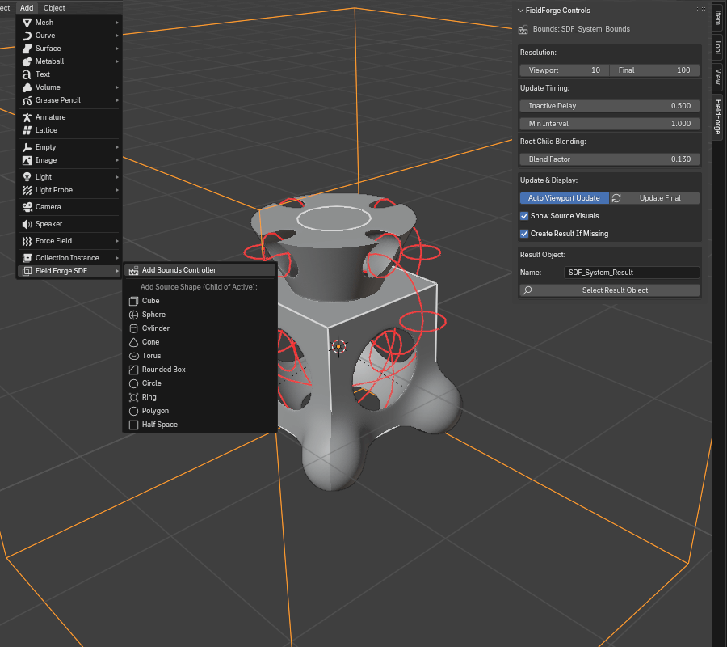

# FieldForge - Dynamic SDF Modeling for Blender

[](https://www.gnu.org/licenses/gpl-3.0)
[](https://www.blender.org)
[](https://libfive.com/)


FieldForge brings the power of Signed Distance Function (SDF) modeling directly into Blender, leveraging the robust **libfive** library and its **included Python bindings**. Create complex, non-destructive shapes with hierarchical control, procedural modifiers, and smooth blending capabilities.

 <!-- Assuming Screenshot.png exists -->

## Features

*   **Non-Destructive Workflow:** Build models using mathematical functions without destructive mesh editing.
*   **Libfive Powered:** Utilizes the fast and reliable libfive engine for SDF calculations and meshing.
*   **Hierarchical Control:** Parent SDF source objects (Empties) to create complex relationships. Control visibility and properties easily.
*   **Custom Viewport Visuals:** Clear wireframe previews for SDF shapes directly in the viewport.
*   **Direct Outline Selection:** Select SDF source Empties by clicking their custom wireframe visuals in the 3D View.
*   **Smooth Blending:** Control the smoothness of unions and differences between shapes, both globally (per system) and per-parent.
*   **Primitive Shapes:** Add pre-defined SDF sources:
    *   Cube
    *   Sphere
    *   Cylinder
    *   Cone
    *   Torus (adjustable major/minor radii)
    *   Rounded Box (adjustable rounding radius)
    *   Circle (extruded)
    *   Ring (extruded, adjustable inner radius)
    *   Polygon (extruded, adjustable sides)
    *   Half Space
*   **Interaction Modes:**
    *   **Negative:** Mark shapes as subtractive.
    *   **Clearance:** Subtract an offset version of the shape (optionally keeping the original).
    *   **Morph:** Smoothly interpolate between a parent shape and the child shape.
*   **Procedural Modifiers:**
    *   **Loft:** Create smooth transitions between two compatible 2D shapes (Circle, Ring, Polygon) along their parent-child Z-axis.
    *   **Shell:** Hollow out a shape with a specified thickness.
    *   **Linear Array:** Repeat shapes along X, Y, and Z axes with counts and offsets.
    *   **Radial Array:** Repeat shapes circularly around a center point.
*   **Per-System Bounds:** Define independent SDF systems using "Bounds Controller" objects, controlling overall size and resolution.
*   **Configurable Resolution:** Set separate mesh resolutions for viewport previews and final renders/manual updates.
*   **Performance Controls:**
    *   Adjustable viewport update delay (debouncing).
    *   Minimum update interval (throttling).
    *   Option to disable automatic viewport updates.
*   **Mesh Management:** Option to automatically discard the generated mesh data when saving the `.blend` file to keep file sizes small (re-generated on load or update).
*   **Integrated UI:**
    *   Add menu (`View3D > Add > Mesh > Field Forge SDF`).
    *   Dedicated panels in the 3D View Sidebar (`N-Panel > FieldForge Tab`) for Bounds Controllers and SDF Sources.

## Dependencies

FieldForge requires specific components **bundled directly within the addon's folder structure**:

1.  **Blender:** Version 4.4 or newer recommended (matches `bl_info`).
2.  **Compiled libfive Libraries & Python Bindings:** The addon needs the **compiled** libfive core library (`libfive.*`), the compiled standard library (`libfive-stdlib.*`), and the **corresponding Python binding files** (`ffi.py`, `shape.py`, `stdlib/*.py`, etc.) all correctly placed within a `libfive` subfolder inside the addon.

## Installation

**IMPORTANT:** FieldForge **must be installed from a complete package (ZIP file)** that includes the pre-compiled libfive libraries and their Python bindings arranged correctly. Installing *only* the Python source files (`.py`) will **not** work.

**Recommended Method (From Release ZIP):**

1.  Download the latest release `.zip` file from the [Releases page](https://github.com/AonoZan/FieldForge/releases).
2.  Open Blender.
3.  Go to `Edit > Preferences > Add-ons`.
4.  Click the `Install...` button.
5.  Navigate to the downloaded `.zip` file and select it.
6.  Click `Install Add-on`.
7.  Find "FieldForge" in the addons list (Category: "Add Mesh") and enable it by checking the box.

**Manual Method (From Source - Requires Correct Bundling):**

This method is generally for developers or advanced users if a pre-packaged release is unavailable.

1.  **Clone or Download:** Get the FieldForge source code (this repository).
2.  **Obtain Compiled libfive + Bindings Bundle:**
    *   You need a package containing the *compiled* libfive core and stdlib libraries (`.dll`/`.so`/`.dylib`) **AND** the compatible Python binding files (`ffi.py`, `shape.py`, `stdlib/shapes.py`, etc.) suitable for your operating system and Blender's Python version.
    *   **This bundle is the crucial part.** Refer to the [libfive project](https://libfive.com/) or related resources for information on obtaining or building such a bundle. You cannot simply install `libfive` system-wide; it needs to be bundled within the addon.
3.  **Arrange Files:** Place the obtained `libfive` components into the FieldForge addon folder, creating the following structure *exactly*:
    ```
    FieldForge/                # Root addon folder
    ├── __init__.py
    ├── constants.py
    ├── utils.py
    ├── drawing.py
    ├── core/
    │   ├── __init__.py
    │   ├── handlers.py
    │   ├── sdf_logic.py
    │   ├── state.py
    │   └── update_manager.py
    ├── ui/
    │   ├── __init__.py
    │   ├── menus.py
    │   ├── operators.py
    │   └── panels.py
    └── libfive/              # <-- Root for libfive components
        ├── __init__.py       # <-- Python Bindings Files are here...
        ├── ffi.py
        ├── runner.py
        ├── shape.py
        ├── src/              # <-- Compiled Core Library goes here
        │   ├── libfive.dll   # Windows
        │   ├── libfive.dylib # macOS
        │   └── libfive.so    # Linux
        │   └── libfive-stdlib.dll  # <-- Compiled Stdlib Library goes here
        │   └── libfive-stdlib.dylib
        │   └── libfive-stdlib.so
        │   # (Potentially other dependencies like libpng.dll, zlib1.dll on Windows)
        └── stdlib/           # <-- Stdlib Components
            ├── __init__.py   # <-- Python Bindings Stdlib Files are here...
            ├── csg.py
            ├── shapes.py
            ├── text.py
            ├── transforms.py
            
    ```
    *(Note: Python files like `ffi.py` and `shape.py` must be directly inside the `libfive` folder. Stdlib Python files like `stdlib/shapes.py` must be inside the `libfive/stdlib` folder).*
4.  **Zip the Addon:** Create a zip archive containing the *entire* `FieldForge` folder (with all its Python files and the correctly structured `libfive` subfolder). The structure inside the zip should mirror the layout shown above, starting with the `FieldForge` folder itself.
5.  **Install in Blender:** Follow steps 2-7 from the "Recommended Method" above, using the zip file you created.

## Basic Usage

1.  **Add Bounds:** Go to `View3D > Add > Mesh > Field Forge SDF > Add Bounds Controller`. This creates an Empty object that defines the region and settings for an SDF system.
2.  **Select Bounds:** Select the newly created Bounds Controller (`SDF_System_Bounds` by default).
3.  **Add Sources:** With the Bounds (or another SDF Source Empty) selected, go to `View3D > Add > Mesh > Field Forge SDF` and choose a source shape (e.g., `Cube`). The new source Empty will be parented to the active object and appear as a wireframe outline.
4.  **Select Sources:** Click directly on the wireframe outline of a source shape in the 3D View to select its controlling Empty.
5.  **Transform Sources:** Move, rotate, and scale the source Empties to position and size the underlying SDF shapes.
6.  **Adjust Settings (N-Panel):** Open the Sidebar (`N` key) and go to the `FieldForge` tab.
    *   Select the **Bounds Controller**: Adjust resolution, update timing, global blend factors, result object management, etc.
    *   Select an **SDF Source Empty**: Set interaction mode (Negative, Clearance, Morph), configure modifiers (Shell, Loft, Array), adjust shape-specific parameters (rounding, radii, sides), and control the blend factor for *its* children.
7.  **Hierarchy:** Parent SDF Sources to each other to build complex forms. The blend factor between siblings is controlled by their *parent's* "Child Blend Factor" property (or the Bounds' "Global Blend Factor" for top-level sources).
8.  **Updates:**
    *   The viewport mesh updates automatically after a short period of inactivity (if "Auto Viewport Update" is enabled in the Bounds settings).
    *   Click "Update Final" in the Bounds Settings panel for a high-resolution update using the "Final Resolution".

## Troubleshooting

*   **"libfive not available" / Addon fails to enable / "Dynamic functionality disabled" message:** This almost always means the **bundled** libfive libraries (`libfive.dll/so/dylib`, `libfive-stdlib.dll/so/dylib`) and/or their Python bindings (`ffi.py`, `shape.py`, etc.) are missing, in the wrong location within the addon folder, or incompatible with your OS/Blender Python version.
    *   **Verify the file structure** shown in the **Installation** section *exactly*.
    *   Ensure you installed from a **complete ZIP package**, not just Python files.
    *   Check Blender's system console (`Window > Toggle System Console`) for specific error messages during startup, especially regarding `LIBFIVE_FRAMEWORK_DIR` or import errors.
*   **Slow Performance:**
    *   Lower the "Viewport Resolution" in the Bounds Settings (N-Panel).
    *   Increase the "Inactive Delay" or "Min Interval".
    *   Disable "Auto Viewport Update" and use the "Update Final" button manually.
    *   Simplify your SDF hierarchy if possible (fewer objects, less complex interactions).
*   **Mesh Not Appearing:** Check if the "Result Object Name" in the Bounds Settings points to an existing mesh object. Ensure "Create Result If Missing" is enabled if the object doesn't exist. Check console for meshing errors (`libfive mesh generation failed`).

## Contributing

Contributions are welcome! Please feel free to submit issues and pull requests. [TODO: Add specific contributing guidelines if desired].

## License

FieldForge is licensed under the **GNU General Public License v3.0**. See the [GPLv3 License](https://www.gnu.org/licenses/gpl-3.0.en.html) for details.

## Acknowledgements

*   **libfive:** The core SDF library. [https://libfive.com/](https://libfive.com/)
