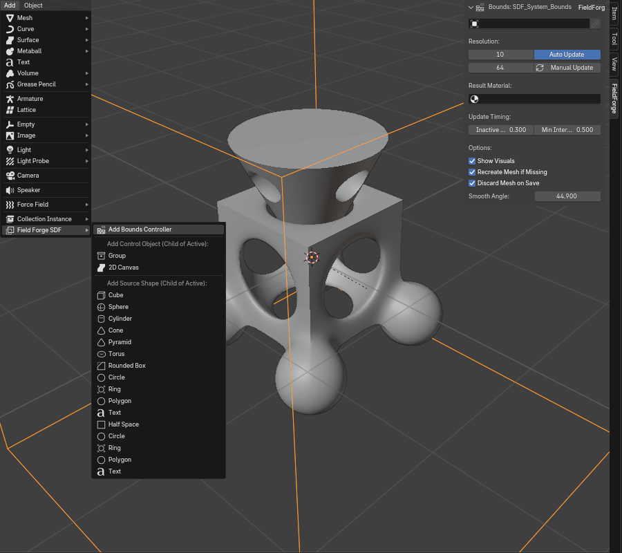

# FieldForge - Dynamic SDF Modeling for Blender

FieldForge brings the power of Signed Distance Function (SDF) modeling directly into Blender, leveraging the robust **libfive** library. Create complex, non-destructive shapes with a deep, hierarchical workflow, procedural modifiers, and smooth blending capabilities.

## Core Concepts

-   **Bounds Controller:** The root of every SDF system. This object defines the overall volume, resolution, and global settings for all shapes within it.
-   **Source:** The basic building block. These are primitive shapes (Cube, Sphere, Cylinder, etc.) controlled by Empty objects. You combine them to create your final model.
-   **Group:** A container that lets you apply transformations and modifiers to a collection of Sources, Groups, and Canvases as a single unit.
-   **Canvas:** A specialized 2D environment for creating and combining 2D shapes (Circle, Ring, Polygon) which can then be extruded or revolved into a 3D shape.
-   **Hierarchy:** The entire system is based on parenting. A Source's relationship to its parent (be it a Bounds, Group, or another Source) defines how it blends and interacts.

## Features

### Modeling & Workflow

-   **Non-Destructive:** Build complex models mathematically without ever touching a vertex.
-   **Hierarchical Blending:** Parent objects to create intricate relationships. The parent's "Blend Factor" smoothly merges all its direct children.
-   **Direct Viewport Interaction:** Select and manipulate SDF objects by clicking their wireframe visuals directly in the 3D viewport.
-   **Linking System:** Link one SDF object's parameters to another. This allows you to create complex, reusable components and instances.
-   **Processing Order Control:** Easily reorder objects in the hierarchy to control the exact sequence of CSG (Union, Difference, Intersect) operations.

### Object Types & Primitives

-   **3D Primitives:** Cube, Sphere, Cylinder, Cone, Torus, Pyramid, and Rounded Box.
-   **2D Primitives (for Canvas):** Circle, Ring, Polygon, and Text.
-   **Half Space:** An infinite plane for cutting or slicing models.

### CSG & Interaction Modes

-   **Standard CSG:** Combine shapes using Union, Difference, and Intersection.
-   **Clearance:** A powerful subtractive mode that removes an offset (enlarged) version of a shape, perfect for creating sockets or joints.
-s   **Morph:** Smoothly interpolate between a parent's shape and a child's shape.

### Modifiers (Per-Source)

-   **Shell:** Hollow out a shape to give it a uniform thickness.
-   **Loft:** Create a smooth transition between two 2D shapes along the Z-axis.

### Modifiers (Per-Group)

-   **Symmetry:** Dynamically mirror all child objects across the Group's local X, Y, or Z axes.
-   **Taper:** Linearly scale child objects along the Group's Z-axis.
-   **Shear:** Skew child objects along one axis based on their position along another.
-   **Twirl:** Twist child objects around a central axis.
-   **Attract/Repel:** Warp child objects by pulling them towards or pushing them away from the Group's origin.
-   **Array:** Create linear or radial arrays of the Group's contents.

### Canvas Operations

-   **Extrude:** Give depth to your 2D canvas creations.
-   **Revolve:** Spin your 2D profile around the Y-axis to create lathed objects.

### Performance & Management

-   **Configurable Resolution:** Set independent mesh resolutions for the viewport and final renders.
-   **Debounced Updates:** The viewport only updates after a user-configurable delay, preventing lag during manipulation.
-   **Throttling:** Limit how frequently the addon can perform updates to maintain UI responsiveness.
-   **Manual Update:** Disable automatic updates and regenerate the mesh only when you choose.
-   **File Size Management:** An option to discard the generated mesh when saving the `.blend` file, keeping your project files lightweight.

## Installation

**IMPORTANT:** FieldForge **must be installed from a complete package (ZIP file)** that includes the pre-compiled libfive libraries and their Python bindings.

1.  Download the latest release `.zip` file from the [Releases page](https://github.com/AonoZan/FieldForge/releases).
2.  Open Blender (`Edit > Preferences > Add-ons`).
3.  Click `Install...`, select the downloaded `.zip` file, and click `Install Add-on`.
4.  Find "FieldForge" in the addons list and enable it.

## Basic Usage

1.  **Add Bounds:** Go to `Add > Mesh > Field Forge SDF > Add Bounds Controller`.
2.  **Add Sources/Groups/Canvases:** Select the Bounds (or any other SDF object) and use the `Add > Mesh > Field Forge SDF` menu to add new objects. They will automatically be parented to the active object.
3.  **Transform & Parent:** Move, rotate, scale, and parent the Empty controllers to build your shape.
4.  **Adjust Settings:** Select any SDF object and go to the `Sidebar (N-Panel) > FieldForge Tab` to access all its unique properties and modifiers.
5.  **Update:** The mesh will update automatically (if enabled). For a high-quality version, select the Bounds Controller and click `Update Final`.

## Troubleshooting

-   **"libfive not available" / Addon fails to enable:** This means the bundled libfive libraries are missing or incompatible. Ensure you installed from the correct, complete ZIP file for your operating system. Check the Blender System Console for detailed error messages.
-   **Slow Performance:** Lower the "Viewport Resolution" in the Bounds settings, increase the "Inactive Delay," or disable "Auto Viewport Update" and use the manual button.

## License

FieldForge is licensed under the **GNU General Public License v3.0**. See the [GPLv3 License](https://www.gnu.org/licenses/gpl-3.0.en.html) for details.

## Acknowledgements

*   **libfive:** The core SDF library. [https://libfive.com/](https://libfive.com/)
